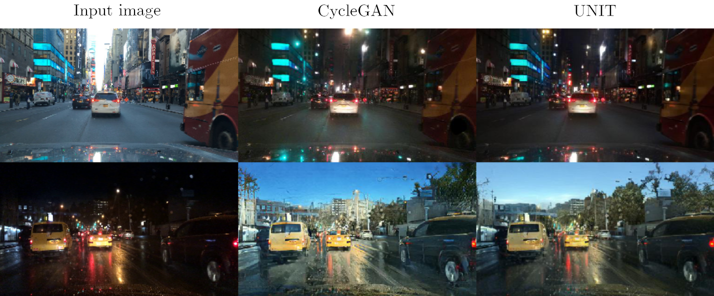

# Day2Night | Image2Image Translation Research 

**[Diploma](./diploma/source/Day2Night.pdf) | Graduation Work | Bachelor's Degree**

__Lomonosov Moscow State University,__ Faculty of Computer Science, Graphics Lab

## UNIT vs. CycleGAN

|                              RetinaNet                              |         Day        |         Night        |         All         |
|:-------------------------------------------------------------------:|:-------------------:|:-------------------:|:-------------------:|
| Real Data                                                           |        0.8664       |        0.8406       |        0.8535       |
| [CycleGAN](https://github.com/junyanz/pytorch-CycleGAN-and-pix2pix) |   0.8701 (+0.42%)   | **0.8571 (+1.96%)** | **0.8636 (+1.18%)** |
| [UNIT](https://github.com/mingyuliutw/UNIT)                         | **0.8749 (+0.98%)** |   0.8512 (+1.26%)   |   0.8631 (+1.12%)   |

|                             Faster R-CNN                              |         Day        |         Night        |         All         |
|:---------------------------------------------------------------------:|:-------------------:|:-------------------:|:-------------------:|
| Real Data                                                             |        0.9015       |        0.8822       |        0.8919       |
| [CycleGAN](https://github.com/junyanz/pytorch-CycleGAN-and-pix2pix)   | **0.9087 (+0.79%)** |   0.8881 (+0.66%)   |   0.8984 (+0.72%)   |
| [UNIT](https://github.com/mingyuliutw/UNIT)                           |   0.9066 (+0.56%)   | **0.8929 (+1.21%)** | **0.8998 (+0.88%)** |

## VGG16 and Normalization

## Results
### UNIT
